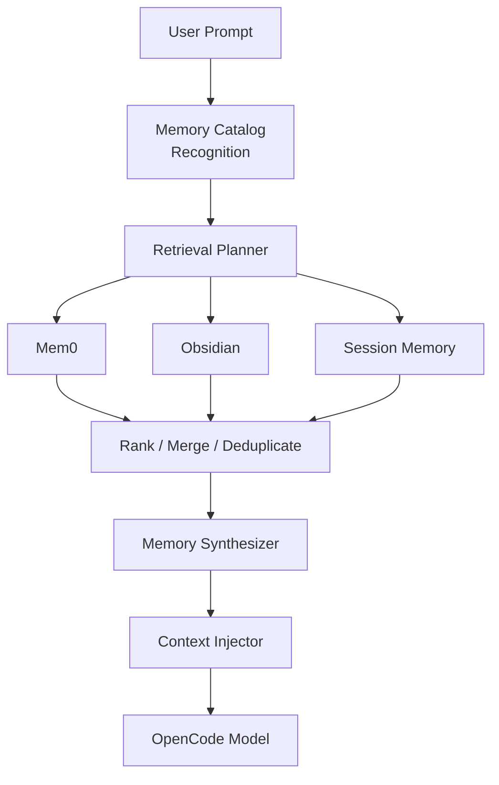
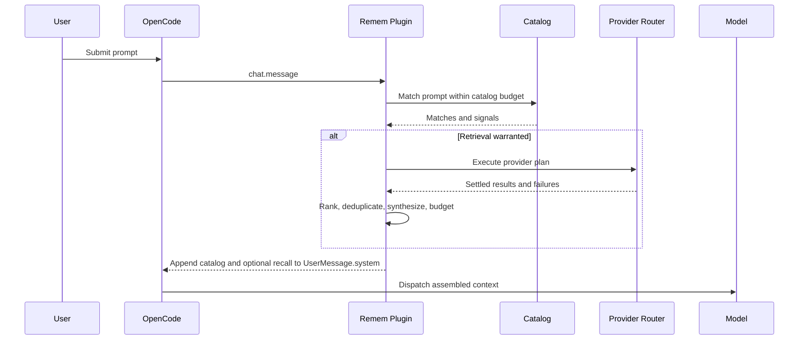
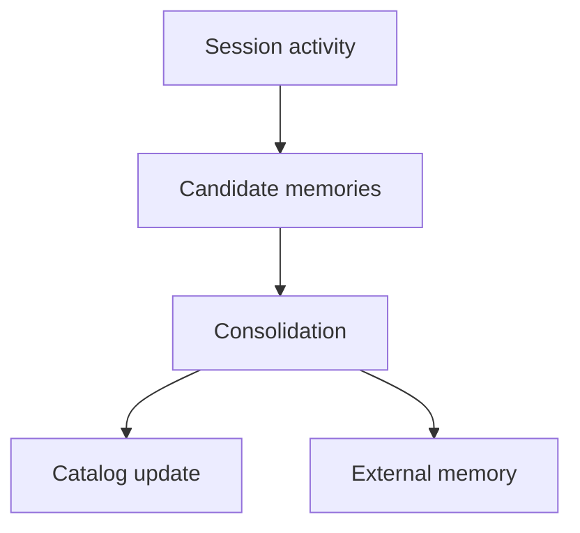
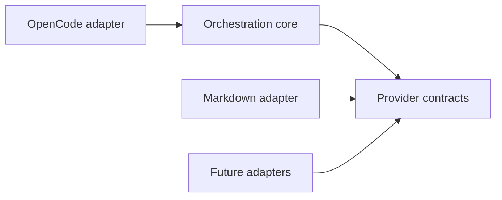

# Architecture

## Purpose

Remem is a control plane between OpenCode and heterogeneous long-term memory systems. It keeps a
small recognition index visible, decides when recall is warranted, routes a bounded query to the
right providers, and injects attributed results without making memory availability a prerequisite
for using OpenCode.

The core sequence is:

```text
recognition -> retrieval planning -> recall -> synthesis -> context injection
```

It is deliberately not `prompt -> vector search -> nearest-neighbor dump`.

## Runtime Pipeline



The MVP implements the same boundaries with a Markdown provider. Mem0, session, and remote
providers are roadmap adapters, not hidden dependencies.



## Learning Path

Consolidation is not required for the MVP, but the data boundaries support it.



Candidate extraction, review, promotion, and provider writes remain separate operations. A future
consolidator must never treat every transcript line as durable truth.

## Components

### OpenCode Adapter

The adapter owns hook types, prompt extraction, custom tools, structured logging, and experimental
compaction compatibility. The core has no dependency on OpenCode message shapes.

### Memory Catalog

The catalog is a compact list of known topics, aliases, scopes, provider locations, and retrieval
hints. It enables recognition without containing the detailed memory itself. Entries are rendered
under a separate token budget.

### Retrieval Planner

The deterministic MVP planner evaluates explicit continuity phrases and lexical catalog matches.
It returns a structured plan and does not query providers when relevance is below threshold. The
interface permits semantic and model-based stages later without forcing an LLM call per turn.

### Provider Router

The router executes only planned provider requests. Each request has its own timeout and failure
boundary. Results carry provider identity, source, scope, type, timestamps, and retrieval signals.

### Recall Pipeline

Recall combines results, removes content-equivalent duplicates, preserves source references, and
ranks by relevance with bounded contributions from importance, freshness, and provider confidence.
Provider similarity is evidence, not truth.

### Synthesizer

The MVP synthesizer is deterministic: it selects bounded excerpts, labels stale records, and keeps
provenance adjacent to every item. It does not invent conflict resolution. A future model-backed
synthesizer will implement the same input/output contract and require explicit external-processing
configuration.

### Context Injector

The injector builds two sections:

1. Persistent memory awareness and the compact catalog.
2. Retrieved working memory for the current prompt, only when planning and recall succeed.

The non-experimental OpenCode hook writes these sections to `UserMessage.system` during prompt admission.
OpenCode then includes that field while assembling each model dispatch for the turn. Experimental
compaction support is isolated in the OpenCode compatibility module.

### Observability

Every turn produces a structured trace containing decisions, provider timing and counts, failures,
deduplication, and estimated token use. Normal logging contains no raw memory content. The
`memory_status` tool exposes the latest trace when deeper diagnosis is requested.

## State and Concurrency

An orchestrator instance belongs to one OpenCode project instance. It stores only:

- the current in-memory catalog snapshot;
- provider capabilities and bounded last-turn diagnostics;
- bounded last-turn traces by session; and
- no durable memory contents beyond provider-owned files.

Catalog refresh is atomic. Provider reads can run concurrently. Results are associated with the
session that triggered them, and no global mutable "current prompt" is used.

## Failure Boundaries

Every augmentation path fails open:

- catalog failure: inject only the memory-system instruction or nothing;
- planner failure: skip automatic recall;
- one provider failure: use settled results from other providers;
- all providers fail: inject no recalled memory;
- synthesis failure: inject catalog only;
- OpenCode compatibility-hook mismatch: retain non-experimental prompt admission;
- logging failure: do not affect context assembly.

Errors appear in diagnostics but are not inserted into the model context as facts.

## Dependency Direction



The contracts do not import OpenCode, filesystem, network, or model SDK types. This prevents a
storage backend or host lifecycle from becoming the architecture.

## Model Portability

Injected memory is plain system text and custom tools use ordinary OpenCode tool contracts. The
core does not use provider prompt caching, Anthropic-specific blocks, OpenAI-only roles, or Bedrock-
incompatible request fields. Model-specific optimizations must remain optional adapters.
