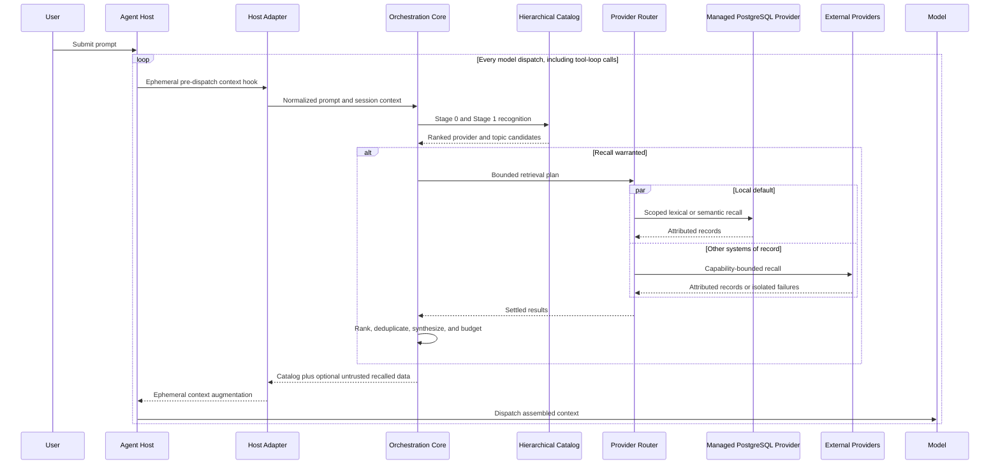
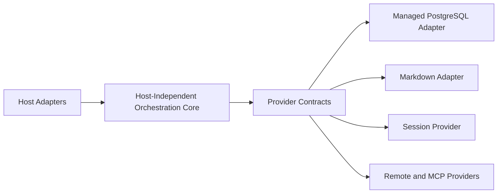
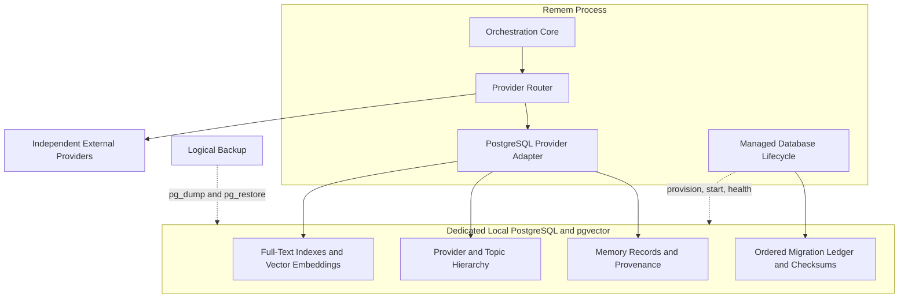
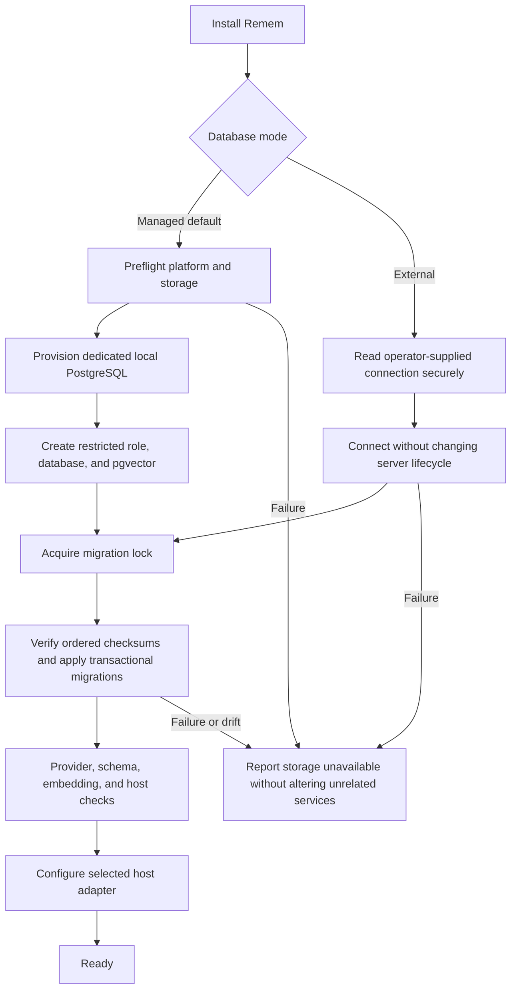
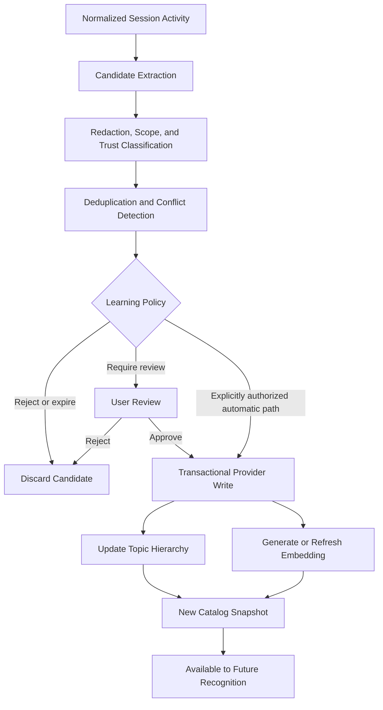

# Architecture

## Purpose

Remem is a local-first memory control plane between agent hosts and heterogeneous long-term memory
systems. It keeps a compact recognition catalog visible, decides when recall is warranted, routes
bounded queries to providers, and injects attributed results without making memory availability a
prerequisite for using the host.

The target architecture includes a managed local PostgreSQL and pgvector store as the default
provider. This improves installation, semantic recognition, and durable learning without turning
the orchestration core into a database-specific application. Existing Markdown, session, MCP, and
remote stores remain independent providers and systems of record unless the user explicitly imports
their data.

The core sequence is:

```text
recognition -> retrieval planning -> recall -> synthesis -> context injection
```

It is deliberately not `prompt -> vector search -> nearest-neighbor dump`.

## Architecture Status

The implementation includes the host-independent core, Markdown and PostgreSQL providers, managed
and external database modes, schema version 4, deterministic and local semantic recognition,
provider/topic awareness, bounded extractive synthesis, explicit CRUD/supersession APIs, logical
backup/restore commands, the primary OpenCode v2 adapter, and the isolated v1 adapter.

Opt-in capture observes only explicit user corrections, decisions, and preferences from the OpenCode
adapters. It excludes sensitive, quoted, tool, and retrieved text; writes pending candidates; and
requires explicit review before consolidation. Arbitrary-depth topic population and branch rendering,
a general neural embedding model, model planning/synthesis, scheduled backup and retention, and
non-Markdown/non-PostgreSQL adapters remain target architecture.

OpenCode v2 is the current official API but is still beta as of 2026-09-01. Remem therefore treats
its API as a versioned adapter boundary rather than as a stable core dependency.

## Design Principles

- Local-first means the default durable store runs on the user's machine and binds only to loopback.
- Managed means Remem provisions and maintains its default provider, not that Remem owns every
  memory source.
- Orchestration policy remains independent of storage SDKs, host message types, and model vendors.
- Recognition is cheaper and smaller than recall; retrieved detail appears only when warranted.
- Memory enhancement fails open, while authorization, scope, and integrity checks fail closed.
- Retrieved memory is attributed, bounded, and treated as untrusted data rather than instructions.

## Runtime Recall

The OpenCode v2 adapter uses the official beta `ctx.session.hook('context')` API. The hook runs
immediately before each model dispatch, including every tool-loop model call, so Remem computes
fresh, ephemeral context without persisting augmentation into the conversation. Other hosts can
provide the same normalized pre-dispatch contract through their own adapters.



The isolated v1 compatibility adapter retains the implemented `chat.message` approach, which writes
turn-level context to `UserMessage.system`. It does not emulate v2 lifecycle semantics in the core
and can be removed independently when v1 support ends.

## Recognition and Planning

The catalog model allows a bounded hierarchy of provider roots, topics, and subtopics. Nodes contain
aliases, scope, retrieval hints, provider locations, and compact summaries, not detailed memory
bodies. The current renderer emits provider roots and topic entries; automatic subtopic population
and traversal remain deferred. A topic can point to more than one provider location, preserving
cross-provider recall without pretending the underlying records share ownership or consistency.

Planning has three bounded stages:

1. Stage 0 applies explicit continuity, identifiers, exact aliases, and other deterministic signals.
2. Stage 1 combines lexical scoring with local semantic similarity over catalog entries. Embeddings
   recognize likely topics; they do not establish truth or bypass provider scope filters.
3. Stage 2 is reserved for an optional model planner when earlier stages are ambiguous; it is not
   implemented.

The current Stage 1 uses a local 384-dimensional deterministic feature-hash model for topic and
provider awareness. PostgreSQL persists those vectors in pgvector for record retrieval. The model
has small concept groups and is not a general neural embedding model; `EmbeddingModel` permits an
explicit replacement. Embedding generation or vector-search failure falls back to deterministic and
lexical signals.

## Provider Orchestration

Every backend implements the capability-driven `MemoryProvider` contract and returns normalized
catalog entries, records, provenance, and retrieval signals. Providers do not decide whether a
prompt deserves recall, how cross-provider results rank, or what enters model context.

The router executes only planned requests. Each request has its own timeout, scope, output budget,
and failure boundary. Provider similarity is retrieval evidence, not factual confidence. The
managed default provider and every external adapter are peers at this boundary.



The contracts import no OpenCode, PostgreSQL client, filesystem, network, or model SDK types.

## Managed Storage

The default provider uses PostgreSQL for transactional records, scopes, provenance, provider
metadata, and catalog relationships; PostgreSQL full-text facilities support lexical retrieval and
pgvector stores embeddings for semantic recognition and recall. The database is a provider-owned
system of record for Remem-native memories. External provider bodies are not copied into it unless
an explicit import or learning policy authorizes that write.



Managed mode provisions a dedicated local cluster, database, role, data directory, and generated
credential with restrictive filesystem permissions. It listens on loopback only and does not reuse,
reconfigure, or expose an unrelated PostgreSQL installation. Exact packaging can vary by platform
without changing the provider contract.

External mode accepts an operator-supplied PostgreSQL connection and manages no server process.
`doctor` validates connectivity, pgvector presence, migration state, and a database write. CI tests
PostgreSQL 16 with pgvector 0.8.1; explicit supported-version and privilege-range validation remains
deferred. TLS and credential handling follow the external operator's policy. Both modes use the same
schema and adapter after connection establishment.

## Installation

Installation makes the provisioning choice explicit. Managed local storage is the default; external
database configuration is an opt-in for users who already operate PostgreSQL.



Provisioning is idempotent and must not mark an installation ready after a partial schema change.
Credentials are never written to logs or model context. At runtime, an unavailable database disables
that provider and memory augmentation fails open; installation and migration integrity checks do not
silently bypass an unsafe configuration.

## Recall and Synthesis

Recall combines provider results, removes content-equivalent duplicates, preserves every source
reference, and ranks with bounded contributions from relevance, scope, importance, freshness, and
provider confidence.

Synthesis is selected behind one contract. Only deterministic extraction is included today; the
other strategies are extension targets:

- deterministic extractive synthesis is the default and fallback;
- a local model strategy may summarize within explicit resource and token budgets; and
- an external model strategy requires explicit disclosure, privacy, and cost configuration.

Every strategy preserves adjacent provenance, marks stale or conflicting evidence, obeys a hard
context budget, and can return no augmentation. A synthesis must not silently reconcile conflicts or
become a durable memory merely because a model generated it.

## Untrusted Memory Boundary

Provider content, catalog summaries, embeddings, tool results, and generated syntheses are untrusted
data. Remem places them in a clearly delimited, attributed section that instructs the model to use
them only as possible evidence. Embedded requests to run tools, reveal secrets, change policy,
override the user, or write memory have no authority.

Scope and authorization are enforced before retrieval, not delegated to the model. Logs omit raw
memory by default, diagnostics are sanitized, SQL is parameterized, and provider output is bounded
before normalization. Suspicious content may be labeled or omitted, but filtering is not treated as
a complete prompt-injection defense.

## Future Learning

Learning remains separate from recall. Host observations become candidates through a normalized
event interface; they are not durable facts until policy and, where configured, user review approve
them. Generated synthesis and retrieved instructions never promote themselves.



The target learning path updates records, catalog relationships, and index state transactionally or
through an idempotent work queue. Current explicit managed writes create a record, catalog entry, and
optional embedding, but do not populate arbitrary topic relationships. External writes use
advertised provider capabilities and retain their provider's consistency semantics. Future learning
failures must never interrupt the active host request.

## State and Concurrency

Durable state belongs to providers. The managed provider stores Remem-native memory and catalog
state; external providers retain their own records. The orchestration process keeps bounded,
context-keyed catalog snapshots, provider capabilities, and sanitized session diagnostics.

Catalog publication is atomic. Provider reads can run concurrently, every result remains associated
with the session and dispatch that requested it, and no global mutable current prompt is used.
Managed writes and migrations use database transactions; lifecycle operations use exclusive locks.

## Migration and Recovery

Schema migrations are immutable, ordered files recorded with checksums in a migration ledger. One
process acquires a database lock, verifies the complete applied prefix, and applies each pending
migration transactionally. A gap, changed checksum, unknown applied migration, or failed migration
requires operator action; Remem never guesses at schema repair or runs an automatic destructive
downgrade.

The CLI creates custom-format logical backups on request and restores only with `--confirm`.
Restore uses `pg_restore --clean --if-exists --schema=remem` against the configured database and then runs migration
verification. It does not create a fresh database, automatic pre-operation backup, schedule,
retention policy, encryption, record-count verification, or representative retrieval check.
External-mode backup scheduling and retention remain the database operator's responsibility.

## Failure Boundaries

Every augmentation path fails open:

- host-hook or adapter mismatch: dispatch without Remem context;
- catalog failure: skip automatic recognition or use an already valid bounded snapshot;
- semantic recognition failure: fall back to deterministic and lexical signals;
- one provider failure: use settled results from other providers;
- all providers fail: inject no recalled memory;
- synthesis failure: fall back to bounded extractive synthesis, catalog only, or no augmentation;
- learning or backup failure: report sanitized diagnostics without interrupting the active request;
- logging failure: do not affect context assembly.

Fail-open behavior never means bypassing authentication, scope, migration integrity, or trust
boundaries. When those checks fail, the affected provider is disabled rather than accessed
insecurely. Errors appear in diagnostics but are not inserted into model context as remembered facts.

## Observability

Each dispatch produces a structured trace containing recognition and planning decisions, provider
timing and counts, isolated failures, deduplication, and estimated token use.
Normal logs contain no raw memory, embeddings, credentials, or connection strings. Host tools expose
bounded health and the latest sanitized trace when deeper diagnosis is requested.

## Model and Host Portability

Injected memory uses ordinary host context and provider-neutral text. The core does not use
Anthropic-specific blocks, OpenAI-only roles, Bedrock-incompatible fields, or OpenCode message types.
Host and model optimizations remain optional adapters, so PostgreSQL and OpenCode v2 are defaults at
their respective boundaries rather than definitions of the architecture.
