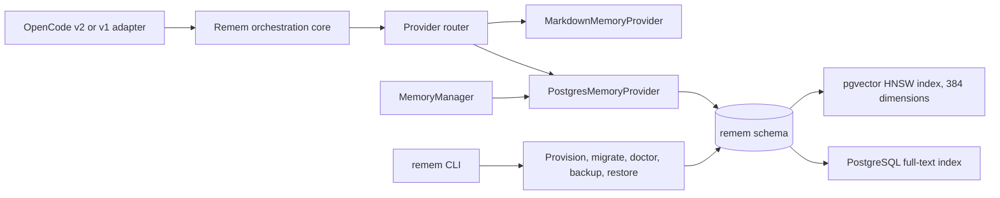
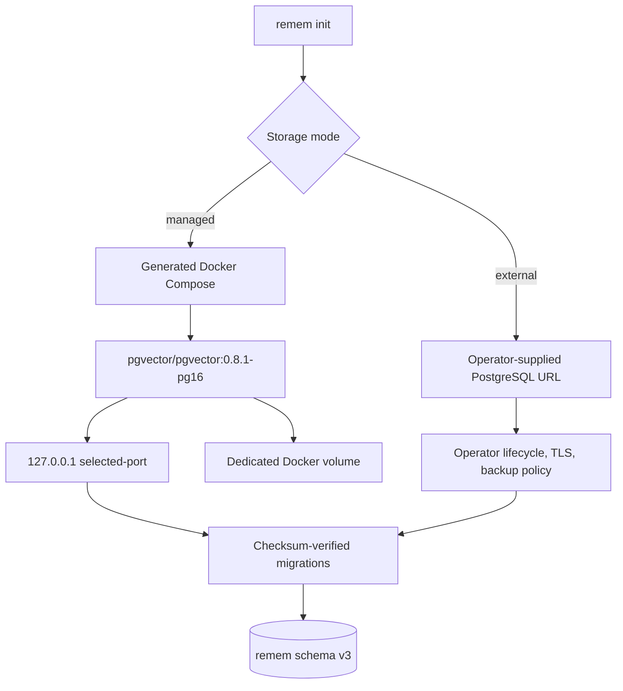

# Storage Architecture

## Scope

Remem uses PostgreSQL and pgvector as its default durable provider while retaining Markdown and
future external systems behind `MemoryProvider`. The canonical runtime, provider, managed-storage,
installation, and learning diagrams are in [Architecture](architecture.md). This document describes
the implemented storage path rather than the full target architecture.

Relevant decisions:

- [ADR 0008: managed default without owning every store](adr/0008-manage-a-default-store-while-remaining-an-orchestrator.md)
- [ADR 0009: PostgreSQL and pgvector by default](adr/0009-use-postgresql-and-pgvector-by-default.md)
- [ADR 0010: managed and external provisioning](adr/0010-separate-managed-and-external-database-provisioning.md)
- [ADR 0012: provider/topic catalog](adr/0012-use-a-hierarchical-provider-topic-catalog.md)
- [ADR 0016: checksum migrations](adr/0016-use-ordered-transactional-checksum-migrations.md)
- [ADR 0017: logical backup and recovery](adr/0017-use-logical-backup-and-recovery.md)

## Implemented Topology



`RememOrchestrator` reads through provider contracts. `MemoryManager` performs explicit point reads
and mutations. The CLI owns provisioning and database operations, not prompt-time orchestration.

## Managed and External Modes



Managed mode generates a unique 32-byte base64url password, writes protected Compose/environment
files, chooses the requested or next available loopback port starting at `54329`, and starts the
container with `docker compose up -d --wait`. The image and health check are pinned in generated
configuration. Data lives in `remem-postgres-data` under a project name derived from the config path.

External mode records a connection URL but never starts, stops, or resets the server. The operator
must supply PostgreSQL with pgvector 0.8 or newer and enough privilege to create the extension, `remem` schema,
tables, indexes, and migration ledger. CI tests PostgreSQL 16 with pgvector 0.8.1; the CLI does not yet
enforce a broader server-version matrix.

Both modes instantiate the same `PostgresMemoryProvider` after connection establishment.

## Schema Version 3

Migration `0001_initial_schema.sql` creates:

- providers and canonical sources;
- memories with scope, type, freshness, supersession, importance, confidence, and generated full-text
  search vectors;
- aliases, tags, and provenance;
- topics and memory-topic links;
- entities, memory-entity links, and typed relationships;
- one optional 384-dimensional embedding per memory;
- catalog entries with optional parent identity and a separate metadata-only recognition embedding;
  and
- GIN, scope/freshness, HNSW cosine, and catalog-provider indexes.

Migration `0002_consolidation_observation.sql` adds session events, candidate memories, and
consolidation records. These tables are foundations only. No current host adapter automatically
writes session events, candidates, or consolidated memories.

Migration `0003_scoped_entities_catalog_embeddings.sql` splits legacy entities by provider and scope,
then adds metadata-only catalog embeddings. Migration `0001` remains immutable so databases created
by earlier builds upgrade without checksum drift.

The application config has `version: 1`; that is the config-file format and is independent of
database schema version 3.

## Migration Integrity

Migration filenames must form a contiguous `0001`, `0002`, ... sequence. On migration, Remem:

1. loads each SQL file and computes SHA-256;
2. acquires a PostgreSQL advisory lock;
3. bootstraps `remem.schema_migrations` if needed;
4. verifies that applied rows are a complete prefix with matching names and checksums;
5. applies each pending migration in its own transaction; and
6. records the checksum atomically with the schema change.

Unknown versions, gaps, renamed migrations, or checksum changes raise an integrity error. Remem does
not rewrite history, run automatic down migrations, or guess how to repair drift.

```sh
remem migrate
remem doctor
```

## Retrieval Storage

Managed writes create canonical memory, provenance, aliases/tags, entities/relationships, a catalog
entry, and, when embedding succeeds, a vector in one transaction. The local model ID and dimension
count are recorded beside the vector.

Search enforces scope in SQL and combines bounded candidate sets:

- `plainto_tsquery('simple', query)` against a weighted generated `tsvector`; and
- cosine similarity against a 384-dimensional pgvector value.

Lexical and vector top-K candidates are selected separately, then unioned and reranked. Stored
vectors are compared only when their model ID and dimensions match the active embedding model.

Embedding failure does not discard a write. The record remains searchable lexically. The default
vector is deterministic feature hashing with small concept groups, not a neural embedding; see
[Retrieval pipeline](retrieval-pipeline.md).

## Catalog Shape

The rendered catalog currently provides provider roots followed by known topic entries. Entries can
carry parent IDs, and the schema supports topic hierarchy, but managed writes do not yet populate
arbitrary topic branches and rendering does not traverse them. This is the implemented subset of
[ADR 0012](adr/0012-use-a-hierarchical-provider-topic-catalog.md).

## Lifecycle Ownership

| Command         | Managed mode                                | External mode                              |
| --------------- | ------------------------------------------- | ------------------------------------------ |
| `remem start`   | Starts Compose, then migrates               | Does not start PostgreSQL; runs migrations |
| `remem stop`    | Runs Compose `down`                         | Makes no server change                     |
| `remem status`  | Runs the same checks as `doctor`            | Runs the same checks as `doctor`           |
| `remem migrate` | Applies verified migrations                 | Applies verified migrations                |
| `remem backup`  | Uses `pg_dump` inside the container         | Uses host `pg_dump`                        |
| `remem restore` | Uses `pg_restore` inside the container      | Uses host `pg_restore`                     |
| `remem reset`   | Deletes the Compose volume and recreates v2 | Refuses                                    |

`REMEM_DATABASE_URL` overrides the stored connection string in external mode. Managed mode ignores
it so provider traffic, migrations, lifecycle, and backup cannot target different databases.
Initialize `--mode external` to change operational ownership.

## Recovery and Failure

Backups are custom-format logical dumps, not data-directory copies. Restore requires `--confirm`,
cleans/replaces existing database objects, and then runs migrations. Reset requires `--confirm` and
is managed-only. See [Backup and restore](backup-restore.md).

At prompt time, an unavailable PostgreSQL provider is isolated and OpenCode continues without its
results. Migration integrity, scope filtering, and destructive-operation confirmation are not
bypassed by fail-open behavior.
